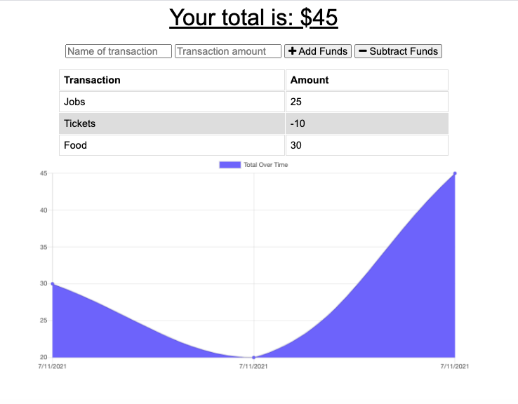

# Homework 19: Budget Tracker App (PWA)

## Table of Contents

- [Description](#description)
- [Installation](#installation)
- [Usage](#usage)
- [Contributing](#contributing)
- [Tests](#tests)
- [Questions](#questions)
- [License](#license)

## Description

A budget tracker that allows users to input and monitor their incoming and outgoing expenditure. Users can input the name of name of a transaction and its amount and it is recorded in both a table and viusalised in a graph below. 

Users are able to add expenses and deposits to their budget with or without an internet connection. When entering transactions offline, the total is then populated when it the app is brought back online.

The app is a progressive web application (PWA) available online and offline. It is intended to assist travellers who may not always have access to an internet connection to manage their funds.

The HTML, Javascript and CSS enhanced front-end is coupled with a node back-end that uses a Mongo database with a Mongoose schema, with the routes handled by Express. 

A service worker, manifest.json and an indexedDB database are used to provide offlne functionality.

It has been deployed on Heroku, with the assistance of MongoDB Atlas.

A Screenshot of the app is also included below.

## Installation

The app works in any browser at the deployed link below.

However, to install the project please clone the repo from GitHub and use the following package manager:

- enter 'npm init' and 'npm i' in the terminal to install all packages.

- Or please ensure all dependencies and dev dependencies are installed (npm install {package}).

- Dependencies: express, mongoose, morgan, compression, lite-server, 

## Usage

Download, install NPM packages, enter npm run dev / node server.js / nodemon server.js to activate server on Port 3000 and run the app.

## Contributing

To contribute further on this project please contacts the repo owners at the GitHub account below. 

## Tests

Further testing with jest package proposed for future development.

## Questions

For any further questions, please contact GitHub user:
[Thom Williams](https://www.github.com/ThomWilliams/)

Or for direct enquiries please email the follower developer address:
thomwilliams1990@gmail.com

## Screenshots

## Deployment / Links

- Heroku: [Heroku](https://gentle-spire-28762.herokuapp.com/)

- Project Repository: [GitHub](https://github.com/ThomWilliams/budget-tracker-tew)

- Issue tracker: [GitHub Issues](https://github.com/ThomWilliams/budget-tracker-tew/issues)

## License

MIT

Copyright (c) [2021] [Budget-Tracker]

Permission is hereby granted, free of charge, to any person obtaining a copy
of this software and associated documentation files (the "Software"), to deal
in the Software without restriction, including without limitation the rights
to use, copy, modify, merge, publish, distribute, sublicense, and/or sell
copies of the Software, and to permit persons to whom the Software is
furnished to do so, subject to the following conditions:

The above copyright notice and this permission notice shall be included in all
copies or substantial portions of the Software.

THE SOFTWARE IS PROVIDED "AS IS", WITHOUT WARRANTY OF ANY KIND, EXPRESS OR
IMPLIED, INCLUDING BUT NOT LIMITED TO THE WARRANTIES OF MERCHANTABILITY,
FITNESS FOR A PARTICULAR PURPOSE AND NONINFRINGEMENT. IN NO EVENT SHALL THE
AUTHORS OR COPYRIGHT HOLDERS BE LIABLE FOR ANY CLAIM, DAMAGES OR OTHER
LIABILITY, WHETHER IN AN ACTION OF CONTRACT, TORT OR OTHERWISE, ARISING FROM,
OUT OF OR IN CONNECTION WITH THE SOFTWARE OR THE USE OR OTHER DEALINGS IN THE
SOFTWARE.
